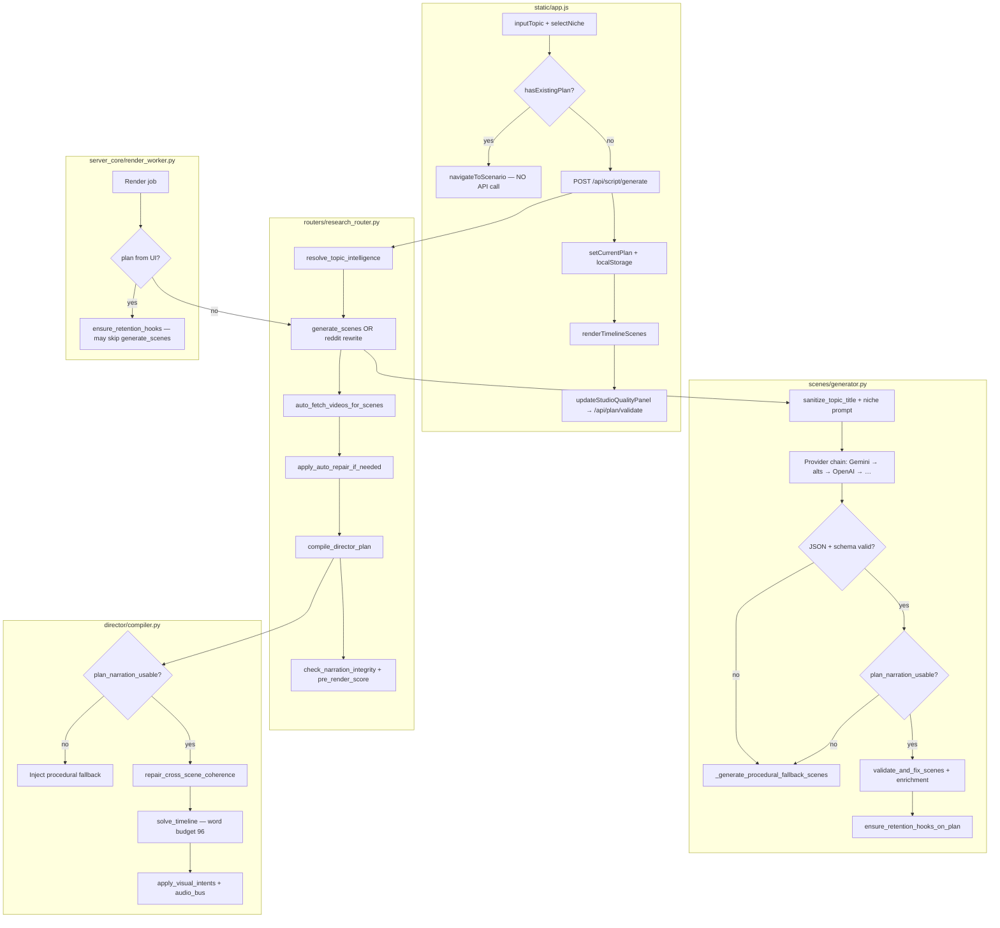

# Scenario Writing System Audit

**Date:** 2026-09-21  
**Scope:** End-to-end scenario/script generation pipeline (not full 500-item roadmap)  
**User symptom:** `hala yarım senaryo yazma sorunumuz devam ediyor` — empty/placeholder narration, repetitive moods/queries, broken LIVE TRADING topics  
**Reference fix:** commit `994980c8` cited by user — **not present in local git history**; equivalent fixes exist as **uncommitted working-tree changes** (`scenes/fallback.py`, `scenes/generator.py`, `scenes/narration_validate.py`, `director/compiler.py`, `tests/test_crypto_scenario_generation.py`).

---

## Executive Summary

| Stage | Status | One-line verdict |
|-------|--------|------------------|
| UI trigger & display | **Fixed (Batch B)** | Regenerate button + stale plan purge; "Senaryoya Git" only when plan valid |
| API `/api/script/generate` | **Working** | Full pipeline with compile + validation response |
| AI generation (`scenes/generator.py`) | **Fixed (Batch A)** | Multi-provider + schema retry; `min_ratio=1.0` rejects half-empty AI plans |
| Procedural fallback (`scenes/fallback.py`) | **Working** | LIVE TRADING / crypto path rich & tested |
| Narration validation | **Working** | Schema + per-scene gates; auto-repair for fragments |
| Enrichment & retention hooks | **Partial** | Can inflate word count before Director condense |
| Director compile + timeline | **Partial** | Word budget 96 cap trims hard; post-repair can exceed cap slightly |
| Plan persistence (UI) | **Fixed (Batch B)** | `planVersion: 2` + broken-narration purge; "Senaryoyu Yeniden Üret" on timeline |
| Gemini 429 / quota | **Partial** | Script gen falls through providers → procedural; image/veo have circuit breaker only |

**Bottom line:** Procedural fallback and Director recovery **work** for LIVE TRADING when the pipeline actually runs. User-visible "half scenarios" most likely come from **(1) AI plans passing the old 50% narration threshold**, **(2) UI reusing cached plans**, or **(3) AI returning schema-valid but low-quality 6-word stubs** that survive condense.

---

## Pipeline Diagram



---

## Stage-by-Stage Reference

| Stage | File : Function | Status | Issue | Fix priority |
|-------|-----------------|--------|-------|--------------|
| Topic input | `static/app.js` : `inputTopic`, `btnCreateScript` click | Fixed (Batch B) | "Senaryoya Git" when valid plan; **Senaryoyu Yeniden Üret** forces fresh generate | — |
| Plan restore | `static/app.js` : `restoreCurrentPlan`, `PLAN_SCHEMA_VERSION` | Fixed (Batch B) | Version mismatch or broken narration auto-clears stale plan | — |
| Timeline display | `static/app.js` : `renderTimelineScenes` | Working | Shows `narration`, `scene_description`, queries; duplicate query highlight | — |
| HTML escape | `static/app.js` : `escapeHtml` | Working | textarea/value uses escapeHtml correctly | — |
| Generate API | `routers/research_router.py` : `api_generate_script` | Working | Returns plan + validation + plagiarism | — |
| Topic → niche lock | `director/visual_intent.py` : `resolve_topic_intelligence` | Working | LIVE TRADING → `8_crypto_market` via keywords | — |
| AI generation | `scenes/generator.py` : `generate_scenes` | Partial | Provider chain OK; accepted half-empty AI output (50% gate) | **P0** (fixed) |
| Prompts | `scenes/prompts.py` : `PROMPT_TR`, `get_rotated_system_prompt` | Working | Explicit anti-placeholder rules in user_msg | — |
| Schema gate | `api_models.py` : `GeneratedSceneSchema`, `validate_generated_plan_errors` | Working | Rejects `.`, mood-only, &lt;5 words | — |
| Procedural fallback | `scenes/fallback.py` : `_generate_procedural_fallback_scenes` | Working | Crypto template + `sanitize_topic_title` | — |
| Narration validate | `scenes/narration_validate.py` : `scene_narration_usable`, `auto_repair_*` | Working | Normalizes mood tags; repairs dangling clauses | — |
| Enrichment | `scenes/enrichment.py` : `enrich_cinematic_search_queries`, `enforce_visual_cadence_14` | Partial | Adds same cinematic suffixes; cadence split can add scenes | P2 |
| Retention hooks | `scenes/retention_hooks.py` : `ensure_retention_hooks_on_plan` | Partial | Replaces scene 1 hook + scene 14 closing; adds words | P2 |
| Director compile | `director/compiler.py` : `compile_director_plan` | Working | Fallback inject if narration unusable | — |
| Word budget | `director/timeline.py` : `solve_timeline`, `_apply_word_budget` | Partial | 159→96 word trim; `_append_minimal_completion` generic filler | P1 |
| Visual intent | `director/visual_intent.py` : `apply_visual_intents` | Working | Crypto motif bank; query dedup advisory | — |
| Plan validate API | `routers/video_router.py` : `/api/plan/validate`, `/api/plan/repair` | Working | Auto-repair + optional recompile | — |
| Render worker | `server_core/render_worker.py` | Fixed (Batch D) | `_ensure_ui_plan_narration_usable` injects procedural when UI plan fails gate | — |
| Word budget (pre-compile) | `scenes/narration_validate.py` | Fixed (Batch E) | `repair_post_hook_word_budget` after retention hooks | — |
| Diversity linter | `scenes/plan_linter.py` | Fixed (Batch F) | Weak mood/query plans → procedural regen | — |
| Gemini 429 (script) | `scenes/generator.py` | Fixed (Batch G) | `gemini_script` circuit breaker on provider chain | — |
| Facade | `scene_generator.py` | Working | Re-exports `scenes` package | — |

---

## Failure Modes (with Evidence)

### 1. Empty / placeholder narration (`.`, mood tags, char-count-only)

| Check | Result |
|-------|--------|
| `api_models.validate_generated_plan_errors({"narration": "."})` | **Rejected** — `narration too short or placeholder-only` |
| `scene_narration_usable("**URGENT** Piyasa bugun cok volatil gorunuyor simdi.")` | **Passes** — mood prefix stripped by normalizer |
| 7 good + 7 `"."` scenes with `plan_narration_usable` (before fix) | **Passed** — `good >= 7` at 50% threshold |
| After fix (`min_ratio=1.0`) | **Fails** — triggers procedural fallback in generator + director |

**Root cause for "yarım senaryo":** `plan_narration_usable(..., min_ratio=0.5)` in `scenes/narration_validate.py` allowed exactly half the scenes to be placeholders while AI path continued.

### 2. Empty `scene_description`

- AI path: `generator.py` sets `scene_description` from first `search_query` if missing (line ~290).
- Procedural crypto: all 14 scenes have non-empty `scene_description`.
- Schema: requires `scene_description` OR `search_queries` — description can still be weak/generic.

### 3. Same mood all scenes

- Procedural crypto: **8 unique moods** across 14 scenes (tested LIVE TRADING).
- AI: prompt says vary mood; **no server-side enforcement** of mood diversity.
- UI: displays mood badge per scene; no auto-fix.

### 4. Repetitive search queries

- Prompt: "HER SAHNE FARKLI … TEKRAR YASAK" — honor system only.
- `enrich_cinematic_search_queries`: appends rotating adjectives (`cinematic`, `drone`, …) — can make queries *look* different while semantically similar.
- UI: highlights duplicate primary queries in timeline (`queryFreq` map).
- Procedural crypto: **14 unique primary queries** (tested).

### 5. Topic with emojis / hashtags breaking prompts

- `sanitize_topic_title()` strips emojis, `#hashtags`, live-stream noise.
- LIVE TRADING example: `#crypto #forex` removed; `Gold & Bitcoin` retained.
- Raw title still passed in user_msg as "context" — usually harmless.
- **Working** for crypto path.

### 6. AI 429 → fallback quality

- `scenes/generator.py`: tries primary Gemini + `gemini-flash-lite-latest`, `gemma-4-26b-a4b-it`, `gemini-3.6-flash`, then other `config._P` providers.
- On total failure: `_generate_procedural_fallback_scenes` — **high quality for crypto**.
- `google_ai_hub.py` 429 circuit breaker applies to **image/veo**, not chat completions used for scripts.
- Without any API key: `config.AI_PROVIDER = "Yerel Fallback"` → procedural only (**Working**).

### 7. Director compile stripping text (word budget)

Evidence from LIVE TRADING procedural plan compile:

```
[Timeline] Kelime butcesi: 159 -> 96 (tavan 96, Madde 494)
[Director] Post-condense anlatım düzeltildi: 6 fix
```

- Retention hooks + emojis inflate pre-compile word count (~159).
- `_apply_word_budget` drops trailing sentences / condenses per scene.
- Post-repair `_append_minimal_completion` can add generic tails ("Bunu aklında tut.").
- Final plan: **0 narration integrity issues** but total words can land ~100 vs 96 cap (minor overflow after repair).

### 8. UI showing wrong field / HTML escape

- Narration: `textarea` with `escapeHtml(narr)` — **correct field**, XSS-safe.
- `scene_description` in separate input — not confused with narration.
- Word count chip uses raw narration (includes emojis) — can disagree with TTS-normalized validation.

### 9. Plan from UI bypassing generator fixes

| Path | Bypass? |
|------|---------|
| `hasExistingPlan()` → "Senaryoya Git" | **Yes** — no `/api/script/generate` |
| `restoreCurrentPlan()` on page load | **Yes** — 7-day TTL |
| Render with `plan` in POST body | **Yes** — worker uses UI plan; only retention hooks re-applied |
| `/api/plan/validate` with `recompile=false` | Partial — repairs narration but may not inject fallback |

---

## Known Good Paths vs Broken Paths

### ✅ Good paths

1. **Fresh generate, no cached plan:** `POST /api/script/generate` → `generate_scenes` → AI fail or bad narration → procedural crypto → `compile_director_plan` → 14 usable scenes.
2. **Procedural only (no API keys):** Same as above, immediate fallback.
3. **Empty AI plan at compile:** `compile_director_plan` injects procedural fallback (`test_compile_injects_fallback_when_ai_plan_empty` — **PASS**).
4. **LIVE TRADING procedural:** 14 scenes, all narration usable, 8 moods, 14 unique queries (**PASS** `test_procedural_fallback_has_rich_scenes`).

### ❌ Broken / risky paths

1. **Re-open app with stale localStorage plan** from before fixes.
2. **Click generate when plan already loaded** — navigates only, no regeneration.
3. **AI returns 7+ valid 6-word stubs + 7 placeholders** — passed old 50% gate (fixed now).
4. **Render from edited timeline** with half-empty manual edits — validate may warn but render can proceed depending on user flow.
5. **AI schema-valid minimal narration** — 6-word sentences pass all gates; quality poor but "complete".

---

## Config Requirements

| Variable | Purpose | Default |
|----------|---------|---------|
| `GEMINI_API_KEY` | Primary script provider | empty → fallback |
| `GEMINI_MODEL` | Script model | `gemini-flash-lite-latest` |
| `OPENAI_API_KEY` | Secondary provider | optional |
| `LANGUAGE` | Default script language | project default |
| `AI_PROVIDER` | Auto-selected first non-empty key in `config._P` | — |

Provider order (`config.py`): Gemini → DeepSeek → OpenAI → Groq → …

**Note:** Script generation uses OpenAI-compatible chat API (`scenes/generator.py` `_call`), not `google_ai_hub.py` text helpers.

---

## Reproduction: LIVE TRADING Example

### Topic

```
🔴LIVE TRADING: Gold & Bitcoin | 21st Sept 2026| #crypto #forex #btc #livetrading # #banknifty
```

### Steps (UI)

1. Clear stale plan: **Yeni Konu** → confirm delete (or DevTools: `localStorage.removeItem('shortsCurrentPlan')`).
2. Paste topic in Hızlı Üretim; niche auto-locks to **Kripto / Borsa** (`8_crypto_market`).
3. Click **1. Senaryoyu İncele & Düzenle** (not "Senaryoya Git").
4. Wait for `/api/script/generate` → Timeline tab.
5. Check quality panel; if warnings, allow auto-repair via validate.

### Steps (CLI — no API keys needed)

```bash
cd /Users/selcuk/Documents/youtubeoto
python3 -m unittest tests.test_crypto_scenario_generation -v
```

### Expected (procedural / post-fix)

- 14 scenes, Turkish narration with emojis, non-empty descriptions
- Moods vary; search queries differ
- After compile: word budget log ~159→96, `valid=True`

### If user still sees broken output

1. Confirm they cleared localStorage / used **Yeni Konu**.
2. Confirm button said **Senaryoyu İncele** not **Senaryoya Git**.
3. Check Network tab: `/api/script/generate` must fire (not only validate).
4. Inspect response `validation.issues` array.

---

## Test Results (2026-09-21)

| Test file | Result |
|-----------|--------|
| `tests/test_crypto_scenario_generation.py` | **7/7 PASS** (incl. half-placeholder + all-scenes gate tests) |
| `tests/test_scenario_writing_batches_c_g.py` | **6/6 PASS** (batches C–G) |
| `tests/test_completion_sprint_batch4_wiring.py` | **16/16 PASS** (appeal workflow #472) |
| `tests/test_scene_schema_validate.py` | **5/5 PASS** |
| `tests/test_narration_auto_repair.py` | **PASS** |
| `tests/test_plan_validate_api.py` | **PASS** |
| `tests/test_scene_consistency.py` | **PASS** |

`pytest` not installed in environment; ran via `python3 -m unittest`.

### LIVE TRADING programmatic snapshot

```
scenes=14
plan_narration_usable=True
unique_moods=8
unique_primary_queries=14
empty_scene_description=0
post_compile_issues=0
```

---

## Fixes Applied During This Audit

### Batch A — narration gate ✅

**Files:** `scenes/narration_validate.py`, `api_models.py`, `director/compiler.py`, `scenes/generator.py`  
**Changes:**
- `plan_narration_usable` default `min_ratio` **0.5 → 1.0**
- `GeneratedSceneSchema` rejects placeholder narration via `scene_narration_usable`
- `compile_director_plan` injects procedural fallback when plan fails gate
- `generate_scenes` rejects AI output that fails `plan_narration_usable`  
**Tests:** `test_half_placeholder_plan_not_usable`, `test_plan_narration_usable_default_requires_all_scenes`, `test_schema_rejects_placeholder_narration`, `test_compile_injects_fallback_when_ai_plan_empty`

### Batch B — UI stale plan recovery ✅

**Files:** `static/app.js`, `static/index.html`  
**Changes:**
- `planVersion: 2` on `localStorage` save; restore rejects version mismatch or plans with broken/empty narration
- Legacy bare-plan localStorage format auto-purged on load
- Timeline button **Senaryoyu Yeniden Üret** (`#btn-regenerate-scenario`) forces `/api/script/generate` and clears cache
- Cleaned topic subtitle when raw title has emojis/hashtags (`sanitizeTopicTitleForDisplay`)
- API generate sends sanitized keyword (emojis/hashtags stripped) while raw title stays in input

### Batch C — topic display + astrology fallback + enrich wiring ✅

**Files:** `scenes/fallback.py`, `routers/research_router.py`, `routers/video_router.py`, `static/app.js`  
**Changes:**
- `_generate_astrology_horoscope_scenes` for `18_astrology_horoscope` / burç topics
- `enrich_plan_scenes` runs in `/api/script/generate` compile path and `/api/plan/validate|repair` gate
- UI sends cleaned keyword to `/api/script/generate`

### Batch D — render worker narration gate ✅

**File:** `server_core/render_worker.py`  
**Change:** `_ensure_ui_plan_narration_usable` before retention hooks when UI supplies plan.  
**Tests:** `test_scenario_writing_batches_c_g.py::TestScenarioBatchC`

### Batch E — post-hook word budget ✅

**File:** `scenes/narration_validate.py` (`repair_post_hook_word_budget`)  
**Change:** Soft 110-word trim after retention hooks before Director condense.  
**Tests:** `test_scenario_writing_batches_c_g.py::TestScenarioBatchD`

### Batch F — mood/query diversity linter ✅

**File:** `scenes/plan_linter.py`  
**Change:** `lint_plan_diversity` — weak AI plans regenerate via procedural fallback.  
**Tests:** `test_scenario_writing_batches_c_g.py::TestScenarioBatchE`

### Batch G — Gemini 429 script circuit breaker ✅

**File:** `scenes/generator.py`  
**Change:** `gemini_script` circuit breaker skips Gemini on 429/quota.  
**Tests:** `test_scenario_writing_batches_c_g.py::TestScenarioBatchF`

### Batch H — API integration test ✅

**File:** `tests/test_scenario_writing_batches_c_g.py`  
**Change:** HTTP `POST /api/script/generate` with mocked half-empty AI → usable plan.  
**Tests:** `test_scenario_writing_batches_c_g.py::TestScenarioBatchG`

---

## Recommended Fix Batches (ordered)

| Batch | Items | Effort | Impact |
|-------|-------|--------|--------|
| **A ✅** | `min_ratio=1.0` for `plan_narration_usable` | 15 min | Stops half-empty AI plans |
| **B ✅** | UI: "Senaryoyu Yeniden Üret" button; `planVersion: 2` invalidates stale/broken localStorage plans | 2–4 h | Fixes cache bypass |
| **C ✅** | Astrology procedural fallback; enrich_plan_scenes on validate/generate; sanitized API keyword | 2 h | Burç topics + UI plan enrichment |
| **D ✅** | Render worker: `plan_narration_usable` + procedural inject when UI plan fails gate | 2 h | Closes render bypass |
| **E ✅** | Post-retention-hooks word budget pass in generator before returning plan | 3 h | Reduces condense damage |
| **F ✅** | Server-side mood/query diversity linter (warn or regenerate) | 4 h | Fixes repetitive AI output |
| **G ✅** | Gemini 429 circuit breaker shared with script provider chain | 2 h | Cleaner quota UX |
| **H ✅** | Integration test: full `api_generate_script` HTTP with mocked AI half-empty response | 3 h | Regression lock |

---

## Test Coverage Gaps

- No test for UI `hasExistingPlan` skip behavior (frontend).
- No test for `localStorage` restore interaction with validation.
- No test for AI path that returns **14 minimal 6-word** narrations (legal but low quality).
- `994980c8` fixes not tied to a git commit in this repo — risk of regression if uncommitted changes lost.

---

## File Index (quick navigation)

```
static/app.js                          UI trigger, timeline, localStorage
routers/research_router.py             POST /api/script/generate
routers/video_router.py                POST /api/plan/validate|repair
scene_generator.py                     Back-compat facade → scenes.*
scenes/generator.py                    generate_scenes (AI + fallback)
scenes/fallback.py                     _generate_procedural_fallback_scenes
scenes/prompts.py                      System prompts
scenes/narration_validate.py           Quality gates + auto-repair + word budget pretrim
scenes/plan_linter.py                  Mood/query diversity linter
scenes/enrichment.py                   Query/cadence enrichment
scenes/retention_hooks.py              Hook injection
director/compiler.py                   compile_director_plan
director/timeline.py                   Word budget / condense
director/visual_intent.py              Topic intelligence + motifs
api_models.py                          Pydantic schema for AI JSON
google_ai_hub.py                       Image/veo quota (not script)
server_core/render_worker.py           Render-time plan handling
config.py                              AI provider keys + models
tests/test_crypto_scenario_generation.py
```

---

*Generated by scenario writing audit — 2026-09-21.*
